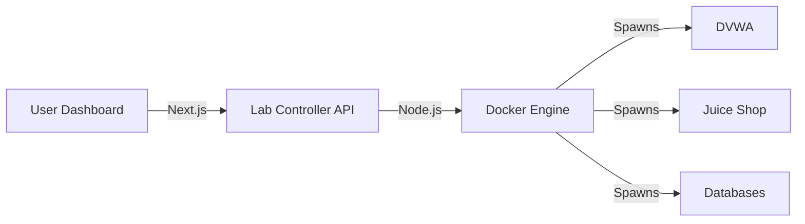

# 🔐 VulnLab Command Center — Professional Setup Guide

Welcome to the **VulnLab Command Center**. This self-contained, automated security lab is designed for security researchers and penetration testers. This guide will walk you through the **manual** deployment of the entire stack.

---

## 🏛️ Project Vision & Architecture
The Command Center doesn't just run labs; it *controls* them. It provides a real-time bridge between a modern web dashboard and localized Docker containers.



---

## 🛠️ Pre-Requisites
Ensure your workstation is configured with the following before starting:
- **Node.js**: v20 or newer (Verify with `node -v`)
- **Docker Desktop**: Installed and running (Verify with `docker ps`)
- **System**: Windows, macOS, or Linux

---

## 🚀 Step-by-Step Deployment (Manual)

Follow these steps exactly to bring the dashboard online.

### 1. Initialize the Vulnerable Labs
Open your terminal in the root of this project and start the Docker containers. This will download and start all 10+ vulnerable targets.
```bash
cd lab-api
npm install
node server.js
```

### 3. Launch the Dashboard (Frontend)
Open a **new terminal window**, navigate to the `webapp` directory, and start the development server.
```bash
cd webapp
npm install
npm run dev
```

### 4. Access the Command Center
Once the frontend starts, open your browser to:
👉 **[http://localhost:3000](http://localhost:3000)**

---

## 💎 Features Checklist
- [x] **One-Click Control**: Start/Stop labs via the UI grid.
- [x] **Live Log Stream**: Real-time terminal output in the browser.
- [x] **Smart Status Badges**: Dynamic indicators for container health.
- [x] **Zero-Config Detection**: API automatically finds your `docker-compose.yml`.

---

## 🔧 Troubleshooting
| Issue | Solution |
|---|---|
| **Docker not found** | Ensure Docker Desktop is open and your user has permissions. |
| **Port 3000 Conflict** | Another process is using port 3000. Run `npm run dev -- -p 3001`. |
| **API Health Check Failed** | Ensure `lab-api` is running on Port 4100. |

---

> [!NOTE]
> For production deployments (e.g., VPS), you can still override the `LAB_DIR` and `NEXT_PUBLIC_LAB_API_URL` environment variables in your `.env` or Vercel dashboard.

*Last Updated: 2026*
