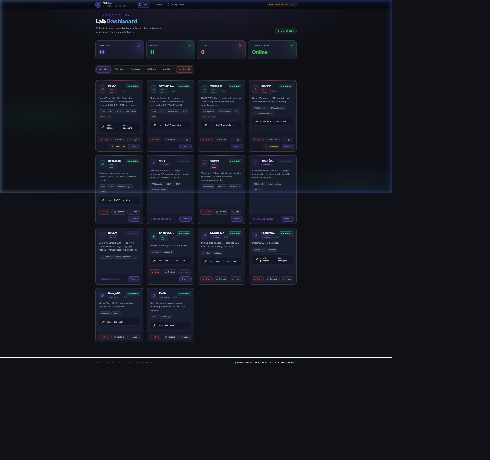

# 🚀 VulnLab Control Center

<p align="center">
  
</p>

A professional, high-performance security lab manager for Docker-based vulnerable applications. This "Command Center" allows security researchers to deploy, monitor, and interact with lab environments without writing a single line of CLI code after setup.

> [!NOTE]
> This application is specifically designed to help learners and professionals understand **Web (Injection, XSS)**, **API (OWASP Top 10 API)**, and **LLM (AI/Prompt Injection)** security vulnerabilities in a safe, controlled environment.

---

## 🛑 Before You Start
Ensure you have the following installed and running:
* **Node.js 20+**
* **Docker Desktop** (Must be running for labs to start)

---

## ⚡ Manual Quickstart

To bring the **Command Center** and all labs online, follow these simple steps:

### 1. Launch the Lab Target Stack (One-Shot)
To start **all** 10+ vulnerable applications and databases instantly, use the **Start All** button in the dashboard or run:
```bash
docker compose up -d
```

### 2. Manual Control (Individual Labs)
You can also start each application individually from the dashboard by clicking the "Start" button on its respective card.

### 2. Start the Lab Controller (API)
```bash
cd lab-api
npm install
node server.js
```

### 3. Launch the Professional Web Dashboard
```bash
# In a new terminal
cd webapp
npm install
npm run dev
```

**🌐 Access Dashboard**: [http://localhost:3000](http://localhost:3000)

---

## 🧬 Project Architecture

| Component | Responsibility | Port |
|-----------|----------------|------|
| **Vulnerable Labs** | 10+ Dockerized targets (DVWA, Juice Shop, etc.) | Varies |
| **Lab API (Backend)** | Controls Docker containers & streams logs | 4100 |
| **Command Center (UI)**| Premium dashboard for lab orchestration | 3000 |

---

## 🧭 Lab Fleet (Auto-Integrated)

The following labs are pre-configured and can be managed directly from the dashboard:

- **Web Apps**: DVWA, OWASP Juice Shop, WebGoat, bWAPP, Hackazon
- **APIs**: vAPI (External), VAmPI, crAPI (External)
- **AI/LLM**: DVLLM (External)
- **Databases**: MySQL, PostgreSQL, MongoDB, Redis

---

## 🏗️ Folder Structure
```
vulnlab-quickstart/
├── docker-compose.yml     ← The lab definition file
├── lab-api/               ← The Express.js control server
└── webapp/                ← The Next.js dashboard UI
```

---

> [!CAUTION]
> **LEGAL & SECURITY NOTICE**: This project is for **authorized security research** only. These containers contain real vulnerabilities. Do NOT host these apps publicly. Use only in your local localhost network.

*Built for Security Research, 2026.*